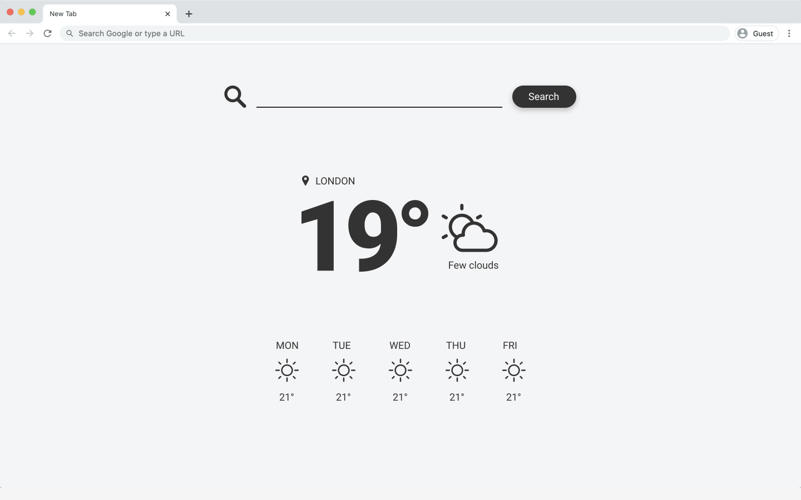

# Coding Challenge

This project was bootstrapped with [Create React App](https://github.com/facebook/create-react-app).

## Available Scripts

In the project directory, you can run:

### `yarn start`

Runs the app in the development mode. 
Open [http://localhost:3000](http://localhost:3000) to view it in the browser.

The page will reload if you make edits. 
You will also see any lint errors in the console.

### `yarn test`

Launches the test runner in the interactive watch mode. 
See the section about [running tests](https://facebook.github.io/create-react-app/docs/running-tests) for more information.

### `yarn build`

Builds the app for production to the `build` folder. 
It correctly bundles React in production mode and optimizes the build for the best performance.

The build is minified and the filenames include the hashes. 
Your app is ready to be deployed!

See the section about [deployment](https://facebook.github.io/create-react-app/docs/deployment) for more information.

## Task

You will be creating _Weather App_ that shows the current weather and the 5-day forecast of the location users type in the search field.

## Acceptance Criteria

* The implementation shouldn't be 100% pixel perfect, although the page should look very similar to the screenshot above.
* The website should look nice on all screens (there is no rule book for that, just use your style feeling creativity).
* The website should work in all modern browsers.
* Please write at least 1 unit test with JEST and 1 e2e test with Cypress
* Optional: requests can be cached in browser.
* Linters, prettifiers, etc. are not mandatory, but highly recommended.

## Tips

* For weather data you may use https://openweathermap.org/.
* For icons you may use https://www.flaticon.com/.
* For fonts you may use https://fonts.google.com/.
* Use your UI/UX experience to make the page user fiendly.
* You are an expert, show your skills! Want to wrap the project into a Docker container, do it. Want to use Redux, why not? But be prepared to explain why you made your decisions.

## Contact

Please ask questions if you have any.

Good luck!# REACT_REDUX_SAGA
